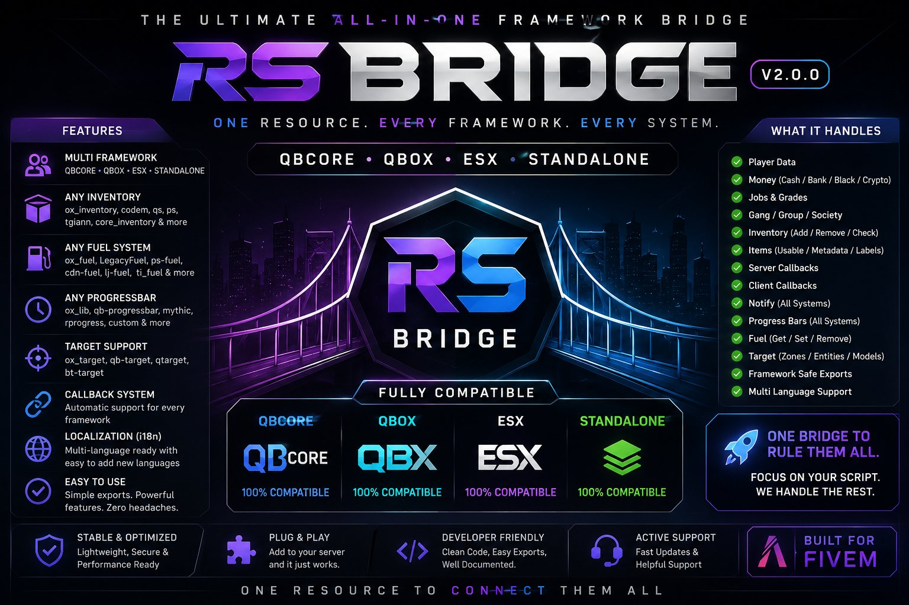

<p align="center">
  
</p>

<h1 align="center">rs_bridge v2.0.0</h1>

<p align="center">
  <strong>One resource. Every framework. Every system.</strong><br>
  QBCore -- Qbox -- ESX -- Standalone
</p>

<p align="center">
  <a href="#install">Install</a> --
  <a href="#server-api">Server API</a> --
  <a href="#client-api">Client API</a> --
  <a href="#locale-api">Locales</a> --
  <a href="#fuel">Fuel</a> --
  <a href="#recommended-pattern">Pattern</a>
</p>

---

## What it is

`rs_bridge` is a single compatibility layer that lets your FiveM resources work on QBCore, Qbox, ESX Legacy, old ESX, or standalone with **zero code changes** in the resource that uses the bridge. You write `exports.rs_bridge:AddItem(src, 'water', 1)` once -- the bridge figures out whether to call `ox_inventory`, `qs-inventory`, `codem-inventory`, `xPlayer.addInventoryItem`, or whatever the server actually runs.

Same idea for notifications, progress bars, target zones, callbacks, fuel systems, and language strings.

## What it handles

- **Player data** -- citizen ID, char info, identifier, job, gang, money, metadata
- **Money** -- cash, bank, black money, crypto (account names normalized per framework)
- **Jobs and grades** -- with `HasJob(src, names, minGrade)` and `HasGroup` helpers
- **Inventory** -- ox_inventory, qs-inventory, codem-inventory, ps-inventory, tgiann-inventory, core_inventory, origen_inventory, framework fallback
- **Usable items** -- QBCore, Qbox, ESX
- **Notifications** -- ox_lib, qbx_core, qb-core, ESX, chat fallback
- **Progress bars** -- ox_lib, progressbar (QB), mythic_progbar, rprogress, rs_progressbar, timer fallback
- **Target** -- ox_target, qb-target, qtarget, bt-target
- **Fuel** -- LegacyFuel, lj-fuel, ps-fuel, cdn-fuel, ox_fuel (statebag), ti_fuel, BigDaddy-Fuel, x-fuel, lc_fuel, okokGasStation, native GTA fallback
- **Callbacks** -- ox_lib, framework, raw event fallback (both server and client)
- **Localization** -- en, es, fr, pt-br included; drop-in support for any language

## Supported frameworks

| Framework        | Resource name    | Status        |
|------------------|------------------|---------------|
| QBCore           | `qb-core`        | full          |
| Qbox             | `qbx_core`       | full          |
| ESX Legacy       | `es_extended`    | full (1.10+)  |
| ESX old          | `es_extended`    | full (1.2 and below via event fallback) |
| Standalone       | none             | safe fallback |

---

## Install

`rs_bridge` is a normal FiveM resource. Drop it in `resources/[bridge]/rs_bridge/` (or wherever you keep shared deps) and ensure it after your framework, before any resource that uses it.

### QBCore

```cfg
ensure ox_lib
ensure qb-core
ensure rs_bridge
ensure your_resource
```

### Qbox

```cfg
ensure ox_lib
ensure qbx_core
ensure rs_bridge
ensure your_resource
```

### ESX Legacy

```cfg
ensure ox_lib
ensure es_extended
ensure rs_bridge
ensure your_resource
```

### Standalone

```cfg
ensure ox_lib
ensure rs_bridge
ensure your_resource
```

### About ox_lib

`ox_lib` is listed as a dependency in `fxmanifest.lua`. It is strongly recommended -- the bridge uses it for the best notification and progress experience, plus callbacks. If you genuinely want zero ox_lib on your server, remove the `@ox_lib/init.lua` line from `shared_scripts` and the `dependency 'ox_lib'` line from `fxmanifest.lua`. All ox_lib code paths will safely fall through to framework-native or chat fallbacks.

---

## Config

`config.lua`:

```lua
RSBridgeConfig.Framework = 'auto'   -- auto, qbox, qbcore, esx, standalone
RSBridgeConfig.Locale    = 'en'     -- en, es, fr, pt-br (or your own)
RSBridgeConfig.Debug     = true

RSBridgeConfig.Notify    = { Provider = 'auto', ... }
RSBridgeConfig.Inventory = { Provider = 'auto' }
RSBridgeConfig.Target    = { Provider = 'auto', DefaultDistance = 2.0 }
RSBridgeConfig.Progress  = { Provider = 'auto' }
RSBridgeConfig.Fuel      = { Provider = 'auto' }
```

Every `Provider` field accepts `'auto'` or a specific resource name. Auto-detection priority is documented inline in `config.lua`.

---

## Server API

### Framework

```lua
local framework = exports.rs_bridge:GetFramework()
-- returns 'qbcore' | 'qbox' | 'esx' | 'standalone'

if exports.rs_bridge:IsQBCore() then end
if exports.rs_bridge:IsQbox() then end
if exports.rs_bridge:IsESX() then end
if exports.rs_bridge:IsStandalone() then end
```

### Player

```lua
local src = source

local Player     = exports.rs_bridge:GetPlayer(src)
local PlayerData = exports.rs_bridge:GetPlayerData(src)
local citizenid  = exports.rs_bridge:GetCitizenId(src)
local charinfo   = exports.rs_bridge:GetCharInfo(src)
local job        = exports.rs_bridge:GetJob(src)
local gang       = exports.rs_bridge:GetGang(src)
```

For ESX, `citizenid` returns the player identifier (license, steam, etc).

### Jobs and groups

```lua
if exports.rs_bridge:HasJob(src, 'police', 2) then
    -- Police, grade 2 or higher
end

if exports.rs_bridge:HasJob(src, { 'police', 'sheriff' }, 0) then
    -- Either of those, any grade
end

if exports.rs_bridge:HasGroup(src, { 'admin', 'god' }, 0) then
    -- Qbox group check, falls back to ESX getGroup, then to HasJob
end
```

### Money

```lua
exports.rs_bridge:AddMoney(src, 'bank', 500, 'mission_reward')
exports.rs_bridge:RemoveMoney(src, 'cash', 50, 'shop_purchase')
exports.rs_bridge:SetMoney(src, 'cash', 250, 'admin_set')

local cash = exports.rs_bridge:GetMoney(src, 'cash')
```

ESX cash works with either `'cash'` or `'money'`. ESX bank uses `'bank'`. QB/Qbox supports `'cash'`, `'bank'`, `'crypto'`.

### Inventory

```lua
exports.rs_bridge:AddItem(src, 'water_bottle', 1)
exports.rs_bridge:RemoveItem(src, 'water_bottle', 1)

if exports.rs_bridge:HasItem(src, 'lockpick', 1) then
    print('Has lockpick')
end

local count = exports.rs_bridge:GetItemCount(src, 'water_bottle')
local item  = exports.rs_bridge:GetItem(src, 'water_bottle')

if exports.rs_bridge:CanCarryItem(src, 'water_bottle', 5) then
    -- weight check via inventory provider
end
```

### Usable items

```lua
exports.rs_bridge:CreateUseableItem('mystery_box', function(source, item)
    exports.rs_bridge:Notify(source, 'You opened the box.', 'success')
end)
```

### Notifications

```lua
exports.rs_bridge:Notify(src, 'You got paid.', 'success', 5000)
-- Notify(src, message, type, duration, title)
```

### Server callbacks

```lua
exports.rs_bridge:RegisterCallback('my_resource:getData', function(source, arg1)
    return {
        ok = true,
        citizenid = exports.rs_bridge:GetCitizenId(source)
    }
end)
```

---

## Client API

### Player data

```lua
local data = exports.rs_bridge:GetPlayerData()
local job  = exports.rs_bridge:GetJob()
local gang = exports.rs_bridge:GetGang()
```

`GetJob().grade.level` works on every framework -- ESX numeric grades are normalized to a table shape.

### Notify

```lua
exports.rs_bridge:Notify('Hello world.', 'success', 5000)
-- Notify(message, type, duration, title)
```

### Progress bar

```lua
local success = exports.rs_bridge:ProgressBar({
    label = 'Searching...',
    duration = 5000,
    canCancel = true,
    disableCombat = true,
    anim = { dict = 'random@domestic', clip = 'pickup_low' }
})

if success then
    print('Done')
end
```

### Fuel

```lua
local veh  = GetVehiclePedIsIn(PlayerPedId(), false)
local fuel = exports.rs_bridge:GetFuel(veh)

exports.rs_bridge:SetFuel(veh, 100.0)
```

Provider is auto-detected. Falls back to `GetVehicleFuelLevel` / `SetVehicleFuelLevel` if no fuel resource is started.

### Target

```lua
exports.rs_bridge:AddTargetEntity(entity, {
    {
        label = 'Talk',
        icon  = 'fa-solid fa-comment',
        action = function()
            print('talking')
        end
    }
})

exports.rs_bridge:AddTargetModel(`prop_atm_01`, {
    {
        label = 'Use ATM',
        icon  = 'fa-solid fa-credit-card',
        action = function() print('ATM') end
    }
})

exports.rs_bridge:AddTargetZone('test_zone', vec3(0.0, 0.0, 72.0), vec3(2.0, 2.0, 2.0), {
    options = {
        { label = 'Use Zone', icon = 'fa-solid fa-circle', action = function() print('zone') end }
    }
})

exports.rs_bridge:RemoveTargetZone('test_zone')
```

---

## Locale API

Each resource ships its own `locales/<lang>.lua` files and registers them at startup. The bridge merges them into one namespaced string table.

### In your resource fxmanifest

```lua
files { 'locales/*.lua' }
```

### In your resource's locales/en.lua

```lua
return {
    captured_ghost = 'You captured the ghost!',
    found_n_items  = 'You found %d items.'
}
```

### In your resource's client or server

```lua
CreateThread(function()
    while not exports.rs_bridge:GetFramework() do Wait(50) end
    exports.rs_bridge:LoadLocales(GetCurrentResourceName())
end)

-- Later
exports.rs_bridge:Notify(
    exports.rs_bridge:_L('my_resource.captured_ghost'),
    'success'
)

exports.rs_bridge:Notify(
    exports.rs_bridge:_L('my_resource.found_n_items', 3),
    'primary'
)
```

The bridge's own strings live under the `rs_bridge` namespace, so `_L('unemployed')` resolves there by default. Resource-specific keys use the dot form: `_L('my_resource.some_key')`.

If the configured language is missing for a resource, the bridge falls back to English. If the key is missing entirely, `_L` returns the key string -- nothing crashes.

---

## Recommended pattern

Inside any resource you build, call **only the bridge**:

```lua
-- Good
exports.rs_bridge:GetPlayer(source)
exports.rs_bridge:AddItem(source, item, amount, metadata)
exports.rs_bridge:Notify(source, 'Done.', 'success')
exports.rs_bridge:_L('my_resource.done')
```

Avoid scattering framework-specific calls through your code:

```lua
-- Avoid
exports['qb-core']:GetCoreObject()
exports.qbx_core:GetPlayer(source)
ESX.GetPlayerFromId(source)
```

Keep framework specifics inside the bridge. That is the entire point.

---

## Defensive design

Every adapter call is wrapped in `pcall` via `RSBridge.safeCall`. If an inventory's export name changes between versions, or a fuel resource isn't quite the shape we expected, the bridge logs a debug message and tries the next adapter or the framework fallback. The worst case is a chat-message notification or a `Wait(duration)` timer-only progress bar -- nothing hard-crashes.

If you find a third-party version where a specific export name has drifted, open an issue or a PR with the version and the export signature. Small patches in `server/inventory.lua`, `client/progress.lua`, or `client/fuel.lua` are usually enough.

---

## Credits

Built by Reality Sucks RP. Free to use, modify, and redistribute. Keep the credit lines in the file headers and we're square.
