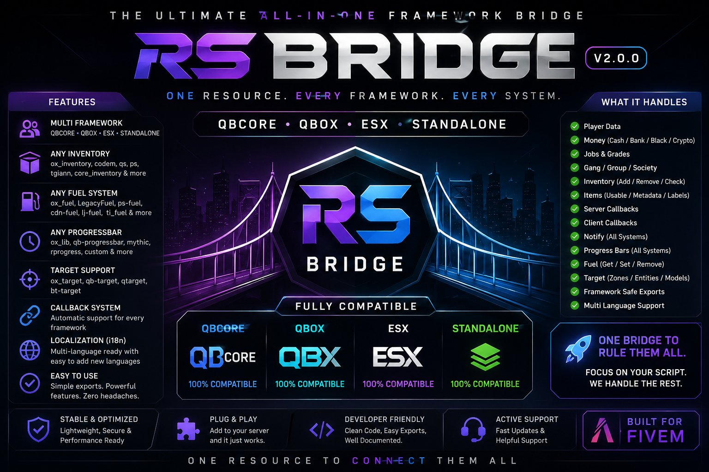

<p align="center">
  
</p>

<p align="center">
  <a href="https://reality-sucks-rp-webstore.tebex.io/package/7628375"></a>
  <a href="https://reality-sucks-rp-webstore.tebex.io/"></a>
  <a href="https://realitysucksrp.github.io/"></a>
  <a href="https://discord.gg/e9V3rPHySx"></a>
</p>

Tebex Store: https://reality-sucks-rp-webstore.tebex.io/</p>
Discord: https://discord.gg/e9V3rPHySx</p>
Youtube: https://www.youtube.com/@RealitySucksRP</p>

# RS Bridge v2.6.0

**Free • Full source • No escrow**

RS Bridge is a universal FiveM framework/provider compatibility layer for server owners and RealitySucksRP resources. It translates common gameplay needs—player data, money, inventory, fuel, keys, targets, progress, callbacks, medical state and HUD visibility—onto the server owner's installed stack.

## One build, runtime detection

Use the **same rs_bridge folder** on GTA V Legacy and GTA V Enhanced. Do not maintain separate Qbox/QBCore/ESX copies. Provider differences belong in runtime detection or `config.lua`, not forked source trees.

Framework detection order on `auto` is: **Qbox → QBCore → ESX → Standalone**. Qbox is checked first because `qbx_core` can provide QB compatibility names; the bridge itself uses native Qbox exports when Qbox is detected.

## Requirements

- FiveM / FXServer
- `ox_lib`
- `oxmysql`
- Optional framework: `qbx_core`, `qb-core`, or `es_extended`

`Standalone` means no gameplay framework is required; it does **not** remove the bridge's `ox_lib` / `oxmysql` dependencies.

Recommended start order:

```cfg
ensure oxmysql
ensure ox_lib
ensure qbx_core        # or qb-core / es_extended, if used
ensure rs_bridge
ensure your_rs_resource
```

## Safe public defaults

For most servers, leave these on `auto`:

```lua
RSBridgeConfig.Framework = 'auto'
RSBridgeConfig.Inventory.Provider = 'auto'
RSBridgeConfig.Target.Provider = 'auto'
RSBridgeConfig.Progress.Provider = 'auto'
RSBridgeConfig.Fuel.Provider = 'auto'
RSBridgeConfig.Vehicles.KeysProvider = 'auto'
RSBridgeConfig.Cash.Provider = 'auto'
RSBridgeConfig.Banking.Provider = 'auto'
RSBridgeConfig.Debug = false
```

Force a provider only when your stack is intentionally ambiguous. If a forced provider is no longer running, v2.6.0 reports it and falls back to supported auto detection instead of turning a stale config line into a gameplay failure.

### Cash is special

`Cash.Provider = 'auto'` uses the framework cash account. This is the safest portable default. Use `inventory_item` only on a server that intentionally models physical cash as an inventory item. `Cash.Item` is consulted only in that mode.

## Diagnostics

Server console:

```text
rsbridgecheck
```

Prints framework, inventory, cash, banking, fuel, key provider and ownership schema.

Client F8:

```text
rsbridgeclient
```

Prints framework, target, progress, minigame and HUD providers.

Startup also prints the server-side provider summary. With `Debug=false`, normal operation stays quiet while actionable startup information remains visible.

## Provider contract

The bridge follows four rules:

1. **Auto detection is deterministic.** First supported started provider in the documented priority wins.
2. **Read failures may fall back.** A failed read can safely try another authoritative source when one exists.
3. **Mutations fail closed.** A provider that throws during AddItem/RemoveItem or money movement is not retried through a different provider; the first provider may already have committed the write. This prevents duplicate rewards and double removals.
4. **Missing optional providers degrade explicitly.** Cosmetic systems can no-op; authority-changing systems return failure rather than inventing success.

## Server authority

The bridge is an environment adapter, not a mission engine. Gameplay resources should keep mission/session truth, payout calculation, inventory requirements and ownership validation on the server. Cfx explicitly recommends validating client-triggered actions server-side.

A good consumer pattern is:

```lua
local Player = exports.rs_bridge:GetPlayer(source)
if not Player then return end

if not exports.rs_bridge:HasItem(source, 'repair_part', 1) then return end
if not exports.rs_bridge:RemoveItem(source, 'repair_part', 1) then return end

exports.rs_bridge:AddMoney(source, 'bank', 500, 'job_reward')
```

Do not send a reward amount from NUI/client and blindly credit it on the server.

## Framework/player API

Server exports include `GetPlayer`, `GetPlayerData`, `GetCitizenId`, `GetCharInfo`, `GetJob`, `GetGang`, `GetJobs`, `GetGangs`, `HasJob`, `HasGroup`, `HasPermission`, `GetMoney`, `AddMoney`, `RemoveMoney`, `SetMoney` and `Notify`.

Client exports include `GetPlayerData`, `GetJob`, `GetGang` and `Notify`.

## Inventory

Supported detection includes `ox_inventory`, `qb-inventory`, `qs-inventory`, `codem-inventory`, `ps-inventory`, `tgiann-inventory`, `core_inventory`, `origen_inventory`, then framework inventory fallback.

Exports: `AddItem`, `RemoveItem`, `GetItem`, `GetItemCount`, `HasItem`, `CanCarryItem`, `CreateUseableItem`, `GetInventoryProvider`.

## Fuel

Supported providers include `ox_fuel`, `qb-fuel`, `LegacyFuel`, `lj-fuel`, `ps-fuel`, `cdn-fuel`, `lc_fuel`, `ti_fuel`, `BigDaddy-Fuel`, `x-fuel`, `okokGasStation`, and native GTA fallback. Framework-aware preference is used before the generic list.

Client:

```lua
local vehicle = GetVehiclePedIsIn(PlayerPedId(), false)
local fuel = exports.rs_bridge:GetFuel(vehicle)
exports.rs_bridge:SetFuel(vehicle, 75.0)
```

Always validate an entity before passing it to a fuel provider.

## Vehicle keys and owned vehicles

Qbox uses the documented entity-based `qbx_vehiclekeys` API when available. Vehicle ownership uses `qbx_vehicles` on Qbox; QBCore/ESX use the configured ownership schema fallback.

Useful exports include `DoesPlayerOwnVehicle`, `GetOwnedVehicles`, `GetPlayerVehicle`, `GetVehicleIdByPlate`, `GiveVehicleKeys`, `RemoveVehicleKeys`, `HasVehicleKeys`, `SetVehicleLockState`, `CreateSessionId`, `DeleteVehicleSafe` and `GetVehicleClassByModel`.

Network identity rule: local entity handles are not portable between client and server. Pass a network ID when a server-side consumer needs to resolve a live entity.

## Target

Supported: `ox_target`, `qb-target`, `qtarget`, `bt-target`. The bridge translates QB `action(entity)` and ox_target `onSelect(data)` callback shapes.

Exports: `AddTargetEntity`, `AddTargetModel`, `AddTargetZone`, `AddTargetCircleZone`, `AddTargetPolyZone`, corresponding removers, and `GetTargetProvider`.

## Progress and minigames

Progress supports `progressbar`, `ox_lib`, `mythic_progbar`, `rprogress`, `rs_progressbar`. Callback-style bars are time-bounded so a broken provider cannot hang a gameplay flow forever.

Minigames use semantic intents (`lockpick`, `hotwire`, `hack`, `generic`) and can resolve through custom provider, `qbx_vehiclekeys`, `ps-ui`, or `ox_lib` skill checks.

## Callbacks

`ox_lib` is the primary callback transport and preserves multiple return values. Consumer code should treat a callback as a question/response, not as authority. The server validates the requested action after the callback returns.

## State bags / OneSync

Use state bags for small replicated facts, not deeply nested mutable objects. Server-authored state is preferred for authority-sensitive facts. Entity state requires a valid entity and appropriate ownership/server authority.

For mission entities, prefer server-created/owned entities where practical and pass network IDs across contexts. A one-time client event is not durable state for late joiners.

## Medical

Medical provider integration is best-effort across Qbox/QBCore/ESX/custom ambulance resources. Server accessors prefer server-visible entity/state/framework metadata before client reports. Client-reported medical state is informational fallback and must not be used as payout/security authority.

## HUD

`SetHudVisible(false/true)` is cosmetic and fail-soft by design. Custom HUD exports use the same safe dynamic-export dispatcher as other provider calls, so argument positions remain correct.

## Version negotiation

Consumer resources can declare:

```lua
rs_bridge_version '2.6.0'
```

Or call:

```lua
local check = exports.rs_bridge:RequireVersion('2.6.0')
if not check.ok then print(check.message) end
```

## Legacy and Enhanced

The bridge itself should not fork simply because the GTA executable is Legacy or Enhanced. Put actual behavioral differences at the native/capability boundary inside the resource that needs them. Enhanced uses Pure Mode and continues to evolve networking/voice behavior; avoid assumptions based on old Mumble/client-owned channel patterns in new code.

## Updating rs_bridge

`config.lua` belongs to the server owner. When updating an existing customized installation, compare the new config keys before replacing it. Do not blindly overwrite a customer's provider overrides or webhook configuration.

For a fresh public installation, start from the shipped auto defaults and override only what the server actually needs.
